## Representação de imagens matriciais

### Definição

Uma imagem digital é constituída por um conjunto de pixels, representado
por uma matriz bidimensional ou tridimensional, de acordo com os tipos
definidos a seguir.

### Tipos

Octave suporta quatro tipos de imagens:

-   imagens em tons de cinza;
-   imagens binárias;
-   imagens RGB;
-   imagens indexadas.

### Imagem grayscale

Uma imagem em tons de cinza (**grayscale**) é representada por uma
matriz bidimensional **M x N**, em que cada elemento expressa a
intensidade do pixel.

``` octave
A = [0 2 4 6 8; 10 12 14 16 18; 20 22 24 26 28];
imagesc(A)
colormap(gray)
axis image % preserva a proporção da imagem
```

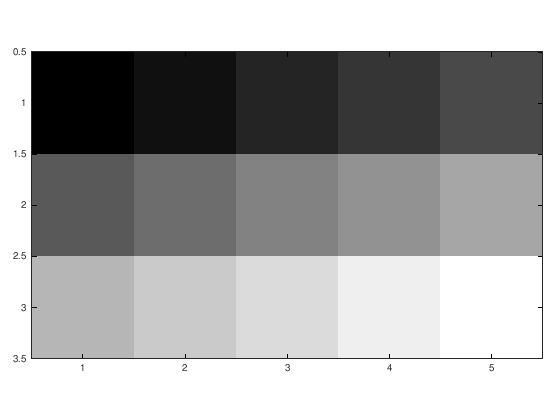

### Intermezzo

A transição de tons de cinza é baseada nos valores discretos na matriz
**A**.

``` octave
num_elementos = numel(A)
```

    num_elementos = 15

A matriz **A** possui apenas 15 valores distintos (em uma matriz de
3x5), o que resulta em uma imagem com transições abruptas entre os
níveis de cinza.

Se aumentarmos a resolução da imagem, podemos obter uma transição mais
suave entre os tons de cinza.

``` octave
outsize = [256 512]; % [y x]
% criamos alguns vetores
x = linspace(0,1,outsize(2)); % linhas
y = linspace(0,1,outsize(1)).'; % colunas
% criamos a matriz no intervalo [0.2 0.8]
Z = 0.2 + 0.3*(x+y);
```

``` octave
num_elementos = numel(Z)
```

    num_elementos = 131072

A matriz **Z** tem 131,072 valores (em uma matriz de 256x512)
distribuídos suavemente, resultando em uma imagem com transições muito
mais suaves entre os níveis de cinza.

``` octave
imagesc(Z) 
caxis([0 1]) % define a escala
colormap(gray(256)) % define o mapa de cores
axis image % preserva a proporção da imagem
```

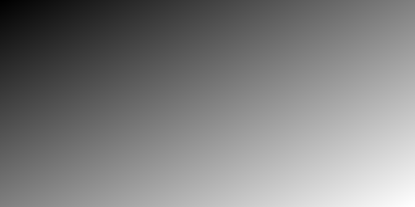

### Imagem binária

A imagem **binária** é uma matriz bidimensional **M x N** da classe
*logical*. Pode ser considerada um caso especial de imagens em tons de
cinza, considerando apenas os dois valores extremos da escala: 0 ou
preto, se falso; 1 ou branco, se verdadeiro.

``` octave
B = eye(5);
B = logical(B);
imagesc(B);
colormap gray
```

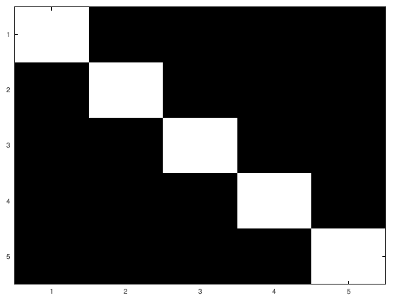

### Imagem truecolor

Uma imagem **RGB** (**truecolor**) é representada por uma matriz
tridimensional **M x N x 3**. Cada pixel da imagem possui uma cor,
resultante da combinação da intensidade de cada um dos canais: **red**
(vermelho), **green** (verde) e **blue** (azul).

``` octave
% Criação da matriz C
C = zeros(3,3,3);
C(:,:,1) = [.1 .2 .3 ; .4 .5 .6; .7 .8 .9]; % vermelho
C(:,:,2) = [.21 .22 .23; .24 .25 .26; .27 .28 .29]; % verde
C(:,:,3) = [.31 .32 .33; .34 .35 .36; .37 .38 .39]; % azul

% Exibir a imagem com imshow para imagens coloridas
imagesc(C);
```

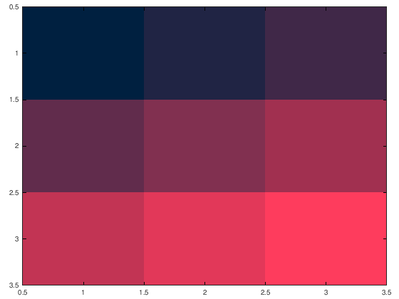

### Imagem indexada

Uma imagem indexada consiste em uma matriz de inteiros **M x N** e um
mapa de cores **C x 3**. Cada número inteiro corresponde a um índice no
mapa de cores e cada linha no mapa de cores corresponde a uma cor
**RGB**. O mapa de cores deve ser da classe *double* com valores entre 0
e 1.

``` octave
[D, map] = rgb2ind (C); % Convertemos de RGB para índice de cores
imagesc(D);
colormap (map)
D
map
```

    D =

      0  1  2
      3  4  5
      6  7  8

    map =

       0.1000   0.2100   0.3100
       0.2000   0.2200   0.3200
       0.3000   0.2300   0.3300
       0.4000   0.2400   0.3400
       0.5000   0.2500   0.3500
       0.6000   0.2600   0.3600
       0.7000   0.2700   0.3700
       0.8000   0.2800   0.3800
       0.9000   0.2900   0.3900

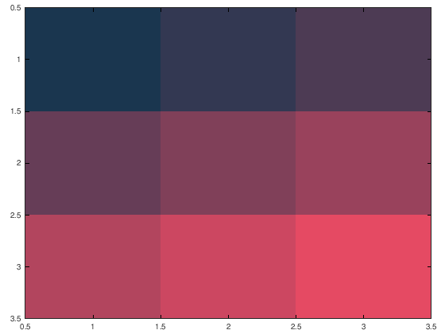

Por economia de espaço, omitimos a expressão numérica da matriz **Z** e
do mapa de cores, no exemplo abaixo.

``` octave
W = double(Z); % Garantimos que A esteja em formato de ponto flutuante
W = W / max(W(:)); % Normalizamos a imagem para o intervalo [0, 1]
%Z = A(1:3,2:4); % Fatiamos a matriz original para o formato 3x3
[D, map] = gray2ind(W);
imagesc(D);
colormap gray
```

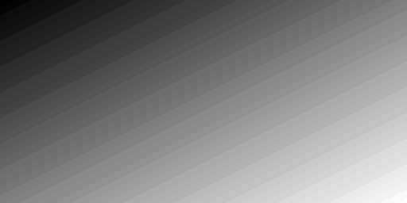

### Classes

A intensidade do pixel, para imagens em tons de cinza e RGB, depende da
classe da matriz. Isto é, a escala esperada dos dados da imagem é
determinada pela sua classe numérica, definida de acordo com os
intervalos nominais descritos na tabela abaixo:

  |Tipo     |Descrição                       |Intervalo|
  |--------- --------------------------------|---------|
  |logical  |Binário                         |0 ou 1   |
  |uint8    |Inteiro sem sinal de 8 bits     |0-255    |
  |uint16   |Inteiro sem sinal de 16 bits    |0-65535  |
  |double   |Real de dupla precisão 64 bits  |0 e 1    |

Para obtermos as classes das matrizes **A**, **B**, **C**, **D** e
**Z**, definimos a seguinte função:

``` octave
function tipos = obterTipos(varargin)
    tipos = cell(size(varargin));
    for i = 1:nargin
        tipos{i} = class(varargin{i});
    end
end

obterTipos(A, B, C, D, Z)
```

    ans =
    {
      [1,1] = double
      [1,2] = logical
      [1,3] = double
      [1,4] = uint8
      [1,5] = double
    }

### Mapas de cores

Um mapa de cores é uma matriz de valores que define as cores de objetos
gráficos.`<br>`{=html} Pode ter qualquer comprimento, mas deve
apresentar três colunas de largura. Na definição de *Peter Kovisi*, pode
ser entendido como uma linha ou curva desenhada através de um espaço de
cores tridimensional.

### Default

**Viridis**, mapa de cores perceptualmente uniforme com luminância
crescente monotonicamente e um arco suave e agradável em tons de azul,
verde e amarelo, de acordo com a descrição de *Kenneth Moreland*, é o
valor padrão adotado pelo Octave, caso não seja fornecido argumento para
a função *colormap()*.

``` octave
F = [0 2 4 6; 8 10 12 14; 16 18 20 22];
imagesc(F)
colorbar
```

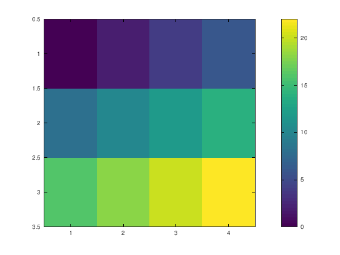

### Exemplos de opções integradas

Octave disponibiliza diversos mapas de cores para escolha do usuário.
Lembramos, no entanto, das advertências para que seja evitado o modelo
*rainbow*, considerado perceptualmente não-uniforme, com transições
enganosas, contra-indicado para pessoas com deficiência visual para
cores, condição conhecida como *daltonismo*.

Exibimos a seguir alguns mapas de cores disponíveis no Octave.

``` octave
% Definimos a imagem
img = [0 2 4 6; 8 10 12 14; 16 18 20 22];


% Definimos os mapas de cores
colormaps = {'viridis', 'prism', 'jet', 'hot', 'cool', 'spring', 
                'summer', 'autumn', 'winter', 'gray', 'bone', 'hsv'};

% Criamos as imagens com a mesma escala, mas diferentes mapas de cores
figure;

for i = 1:12
    ax = subplot(2, 6, i);
    colormap(ax, colormaps{i});
    imagesc(img);
    axis off;
    title(colormaps{i});
end

% Ajustamos o tamanho da figura para caber todos os subplots
set(gcf, 'Position', [100, 100, 1200, 600]);
```

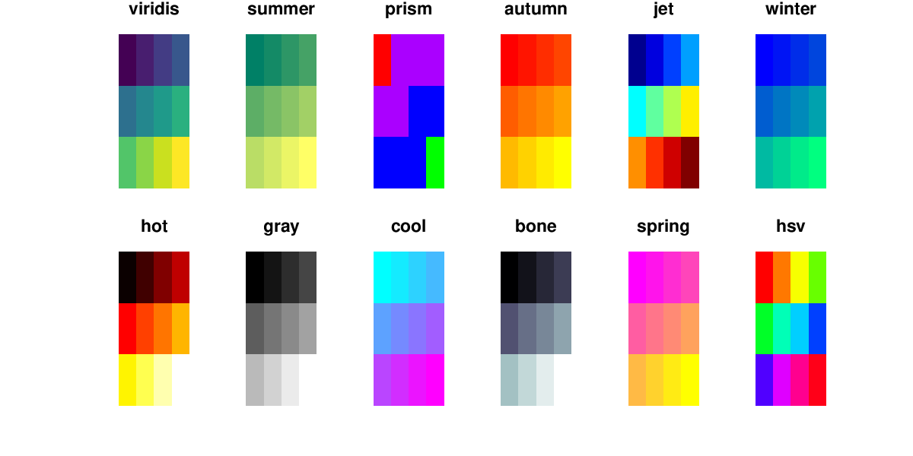

### ColorCET

*ColorCET* é um conjunto de mapas de cores perceptualmente uniformes,
distribuído sob a licença *Creative Commons*, criado por *Peter Kovisi*,
cuja versão para Octave pode ser baixada no endereço
<https://colorcet.com/download/index.html>.

``` octave
cm = colorcet('C2');
imagesc(F)
colorbar
colormap(cm)
```

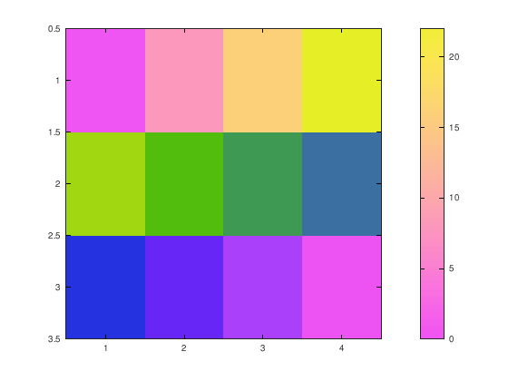

### Transformações

Podemos realizar operações com as matrizes numéricas para produzir
alterações nas imagens.

Temos a matriz original:

``` octave
G = [1 2 3; 4 5 6; 7 3 1; 4 4 4];
imagesc(G)
colorbar
colormap jet
```


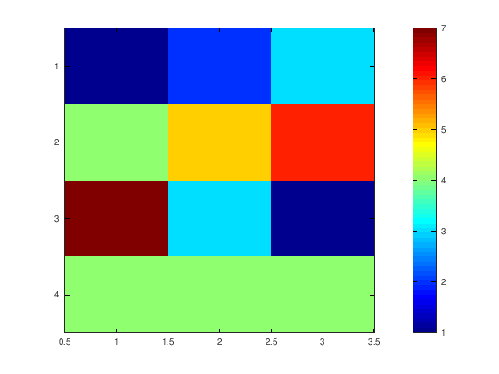

Realizamos uma transformação trigonométrica:

``` octave
G = [1 2 3; 4 5 6; 7 3 1; 4 4 4];
G2 = G .^ cos(pi);
imagesc(G2)
colorbar
colormap jet
```

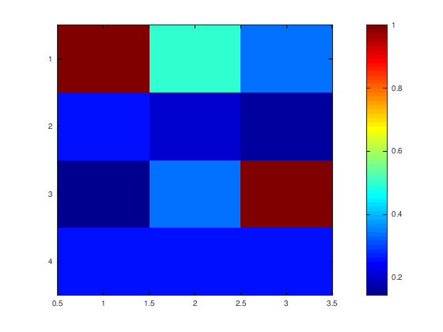

Em seguida efetuamos uma transformação geométrica:

``` octave
G3 = G .^ 2;
imagesc(G3)
colorbar
colormap jet
```

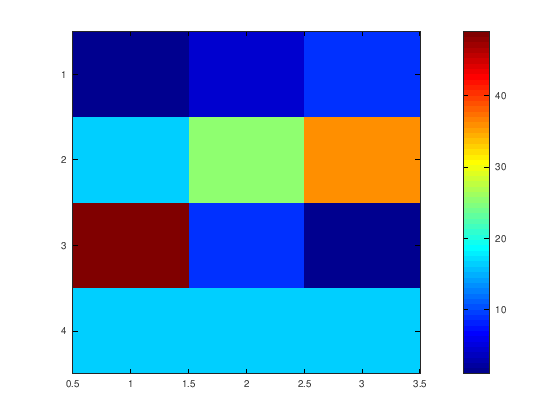

Finalizamos com uma transformação espacial:

``` octave
G4 = fliplr(G);
imagesc(G4)
colorbar
colormap jet
```

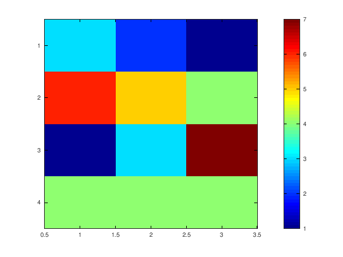

**Referências**:

Eaton, John W., Bateman, David , Hauberg, Søren, Wehbring, Rik (2024).
GNU Octave version 9.2.0 manual: a high-level interactive language for
numerical computations.

Kovesi, Peter (2015). Good Colour Maps: How to Design Them.
arXiv:1509.03700 \[cs.GR\].

Kovesi, Peter (2024). *ColorCET - Perceptually Uniform Colour Maps*.
Acessado em 06/08/2024: <https://colorcet.com/>.

Moreland, Kenneth (2016). *Why We Use Bad Color Maps and What You Can Do
About It.* In Proceedings of Human Vision and Electronic Imaging (HVEI),
February 2016. DOI 10.2352/ISSN.2470-1173.2016.16.HVEI-133.`<br>`{=html}

Moreland, Kenneth (2016). *Color Map Advice for Scientific
Visualization*. Acessado em 06/08/2024:
<https://www.kennethmoreland.com/color-advice/>.

